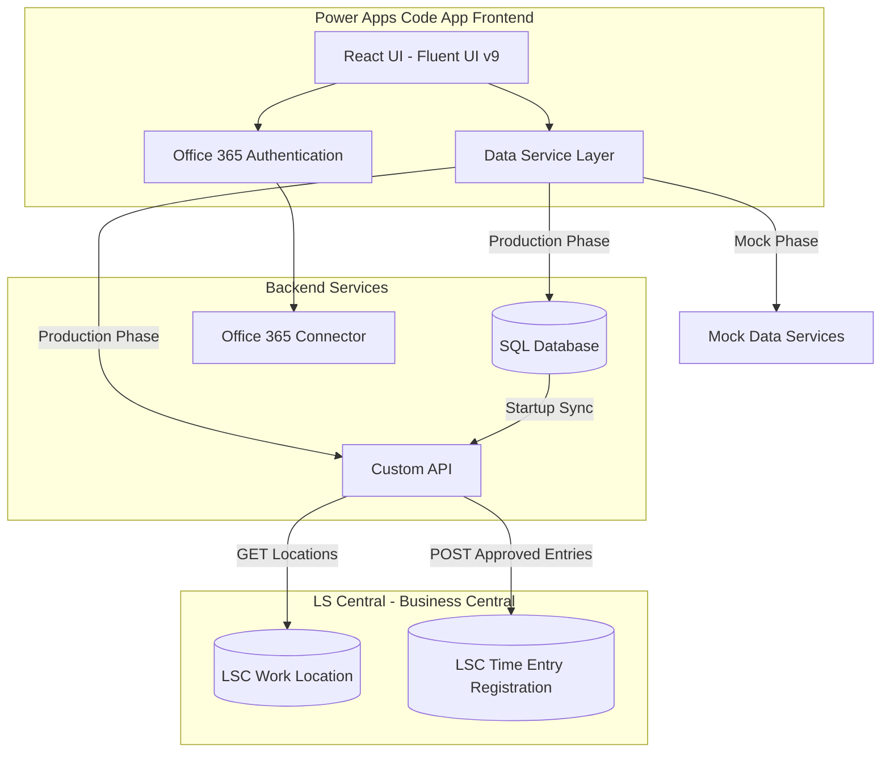
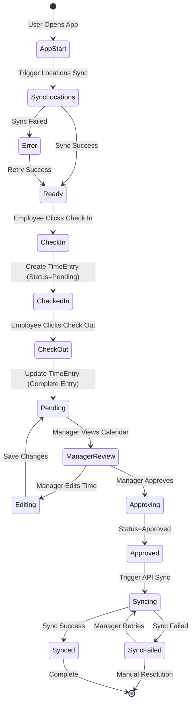

# Time Registration App - Requirements

## Project Overview
This is a **Time Registration App** for LS Central integration enabling employees to check in/out and managers to approve time entries. The app is built with Power Apps Code Apps framework using a **mock-first development strategy** where the application is initially developed with realistic mock data, then migrated to live Power Platform connectors.

**Primary Purpose**: 
- **Provide Employee Time Tracking**: Simple check-in/check-out interface for employees to record work hours
- **Enable Manager Approval**: Calendar-based tabular view for managers to review, edit, and approve entries
- **Integrate with LS Central**: Sync approved time entries to LS Central Staff Management tables via Custom API
- **Mock-to-Production Workflow**: Build and test with mock data, then seamlessly migrate to real connectors

**User Journey**: Develop with mocks → Test locally → Connect Office 365 → Connect SQL → Connect Custom API → Deploy to Power Platform

**Integration Points**:
- **Office 365**: User authentication and profile data
- **SQL Database**: Staging area for time entries and cached work locations
- **Custom API**: Two-way sync with LS Central (GET locations, POST approved entries)
- **LS Central Tables**: LSC_TIME_ENTRY_REGISTRATION, LSC_WORK_LOCATION, LSC_STAFF_EMPLOYEE

---

## System Architecture



### Technology Stack

| Component | Technology | Purpose |
|-----------|-----------|---------|
| Frontend Framework | React 18 + TypeScript + Vite | UI development |
| UI Library | Fluent UI v9 | Microsoft design system |
| Platform | Power Apps Code Apps | Power Platform integration |
| Authentication | Office 365 Connector | User identity and profile |
| Database | SQL Server | Staging time entries and locations |
| Integration | Custom API | LS Central synchronization |
| Development | Mock Data Services | Local testing without connections |

### Key Technical Requirements

- **Port Requirement:** Application must run on port 3000 (Power Apps Code Apps requirement)
- **Auto-Refresh:** 30-second polling interval for data updates
- **Refresh Behavior:** Auto-refresh pauses during manager editing operations
- **TypeScript:** `verbatimModuleSyntax` must be false for Power SDK compatibility

---

## Core Features

### 1. Employee Time Entry Interface
**Current Implementation**: Static interface with mock data for development
- **Features**:
  - Three-tab navigation: Time Entries, User Profile, History
  - Check-in/Check-out functionality with location selection
  - Real-time status indicator (Checked In/Out)
  - **Dashboard component displaying elapsed time since check-in** with live countdown/countup
  - Visual progress indicator showing time worked vs expected work hours
  - Personal time entry history with filtering
  - Auto-refresh every 30 seconds with manual refresh option
- **Mock Data Structure**: Matches SQL TimeEntries table schema and Office 365 user format
- **Migration Path**: Service interface pattern for seamless transition to live connectors
- **Target Connectors**: Office 365 Users connector, SQL connector
- **Validation**: SQL-enforced unique constraint preventing duplicate active check-ins

### 2. Manager Approval Dashboard
**Purpose**: Calendar-based tabular view for reviewing and approving employee time entries
- **Features**:
  - Calendar date picker (unlimited date range)
  - Tabular DataGrid with all entries for selected date
  - Row-level approve/reject actions with icon buttons
  - Bulk approval with multi-select checkboxes
  - Edit time entries before approval (pauses auto-refresh)
  - View sync failures and manual retry mechanism
  - Filter by status, employee, and date range
- **Mock Data Implementation**: In-memory array simulating SQL database operations
- **Migration Goal**: GitHub Copilot-assisted replacement of mock service with SQL connector
- **Target Integration**: SQL connector for TimeEntries CRUD operations
- **Auto-Refresh**: 30-second interval with pause during edit dialog

### 3. Office 365 Integration
**Current Implementation**: User authentication and profile display with mock data
- **Features**:
  - Office 365 authentication using Power Platform SDK
  - User profile display (name, email, photo)
  - Office 365 user ID used as EmployeeNo for LS Central sync
  - No user data stored in SQL (read-only from connector)
- **Mock Data Structure**: Matches Office 365 Users connector API response format
- **Migration Path**: Clear TODO comments for Copilot-assisted conversion
- **Target Connector**: Office 365 Users connector (`shared_office365users`)

### 4. SQL Database Integration
**Purpose**: Staging area for time entries before LS Central sync
- **Features**:
  - TimeEntries table with complete check-in/out lifecycle
  - WorkLocations table cached from LS Central
  - Status workflow: Pending → Approved → Synced/SyncFailed
  - Server-side pagination for large datasets
  - Unique constraint preventing duplicate active check-ins
- **Mock Implementation**: Service layer with in-memory arrays mimicking SQL structure
- **Copilot Integration Goal**: Guide users through replacing mock database calls with SQL connector
- **Tables**: TimeEntries, WorkLocations (based on LSC_TIME_ENTRY_REGISTRATION schema)

### 5. Custom API for LS Central Sync
**Current Implementation**: Mock API responses simulating LS Central integration
- **Endpoints**:
  - GET /api/worklocations - Fetch locations from LS Central at app startup
  - POST /api/timeentries - Sync approved entries to LSC_TIME_ENTRY_REGISTRATION table
- **Features**:
  - Field mapping from SQL to LS Central table structure
  - Per-entry success/failure tracking
  - Retry mechanism for failed syncs (manual trigger)
  - Error logging with detailed messages
- **Mock Data Structure**: Designed to match LS Central API response formats
- **Migration Path**: Structured for easy Copilot-assisted conversion to custom connector
- **Target Integration**: Power Platform custom connector for LS Central Business Central API

### 6. Data Pagination Support
**Purpose**: Efficiently handle large time entry datasets
- **Implementation**: Page-based navigation with configurable page size
- **Features**:
  - Page size selection (25, 50, 100 items per page)
  - Total record count display
  - Previous/Next navigation buttons
  - Loading states during page transitions
  - Server-side pagination for SQL queries
- **Apply to**: Manager dashboard DataGrid, Employee history view

---

## User Roles and Permissions

### Employee Role

**Access:**
- View own time entries only (filtered by Office365UserId)
- Create check-in/check-out records
- View personal profile from Office 365
- View personal time entry history

**Restrictions:**
- Cannot edit time entries after creation
- Cannot view other employees' data
- Cannot approve or manage entries

**Navigation:**
- Time Entries (check-in/check-out)
- User Profile (Office 365 data)
- History (personal entries list)

### 3.2 Manager Role

**Access:**
- View all employee time entries (no user filtering)
- Edit check-in/check-out times before approval
- Approve/reject individual entries
- Bulk approve multiple entries
- View sync failures and trigger manual retry
- Add approval comments

**Restrictions:**
- Cannot delete time entries
- Cannot edit entries after sync to LS Central (Status=Synced)

**Navigation:**
- Calendar-based date selection
- Tabular view with all entries for selected date
- Edit and approval dialogs

---

## 4. SQL Database Schema

### 4.1 TimeEntries Table

Stores employee time entries before and after approval. Based on LSC Time Entry Registration structure.

| Column | Type | Constraints | Description |
|--------|------|-------------|-------------|
| Id | INT | PK, IDENTITY | Auto-increment primary key |
| BCId | UNIQUEIDENTIFIER | NULL | Business Central record GUID (after sync) |
| EmployeeNo | NVARCHAR(50) | NOT NULL | Office 365 User ID or LS Central employee code |
| WorkLocation | NVARCHAR(20) | FK → WorkLocations.Code | Location code |
| WorkRoleCode | NVARCHAR(10) | NULL | Role code during shift |
| SystemDateEntry | DATE | NOT NULL | System-captured check-in date |
| SystemTimeEntry | TIME | NOT NULL | System-captured check-in time |
| SystemDateExit | DATE | NULL | System-captured check-out date |
| SystemTimeExit | TIME | NULL | System-captured check-out time |
| UserDateEntry | DATE | NULL | Manager-adjusted check-in date |
| UserTimeEntry | TIME | NULL | Manager-adjusted check-in time |
| UserDateExit | DATE | NULL | Manager-adjusted check-out date |
| UserTimeExit | TIME | NULL | Manager-adjusted check-out time |
| NoOfHours | DECIMAL(10,2) | NULL | Calculated hours worked |
| Status | NVARCHAR(20) | NOT NULL | Pending/Approved/Synced/SyncFailed |
| BCStatus | NVARCHAR(20) | NULL | Business Central status (Open/Closed/Processed) |
| RetryFlag | BIT | DEFAULT 0 | Retry sync for failed entries |
| SyncErrorMessage | NVARCHAR(500) | NULL | Error details from sync failures |
| ManagerId | NVARCHAR(50) | NULL | Manager who approved (Office 365 ID) |
| ApprovalComment | NVARCHAR(500) | NULL | Manager's approval notes |
| EntryMethod | NVARCHAR(20) | DEFAULT 'Manual Entry' | Entry method |
| OriginLogon | NVARCHAR(50) | DEFAULT 'PowerApps' | Entry origin |
| ODataETag | NVARCHAR(100) | NULL | ETag for optimistic concurrency |
| CreatedAt | DATETIME2 | DEFAULT GETUTCDATE() | Record creation timestamp |
| UpdatedAt | DATETIME2 | DEFAULT GETUTCDATE() | Last modification timestamp |

**Indexes:**
- `IX_TimeEntries_EmployeeNo` ON (EmployeeNo)
- `IX_TimeEntries_Status` ON (Status)
- `IX_TimeEntries_SystemDateEntry` ON (SystemDateEntry)
- `IX_TimeEntries_EmployeeNo_Status` ON (EmployeeNo, Status)

**Unique Constraint:**
```sql
CONSTRAINT UQ_ActiveCheckIn UNIQUE (EmployeeNo, SystemDateExit, SystemTimeExit) 
WHERE SystemDateExit IS NULL AND SystemTimeExit IS NULL
```
Prevents duplicate active check-ins (one open entry per employee).

### 4.2 WorkLocations Table

Cached work locations synced from LS Central at app startup. Based on LSC Work Location (Table 10015021).

| Column | Type | Constraints | Description |
|--------|------|-------------|-------------|
| Id | UNIQUEIDENTIFIER | NULL | Business Central record GUID |
| Code | NVARCHAR(20) | PK | Location identification code |
| Description | NVARCHAR(100) | NOT NULL | Location display name |
| WorkRegion | NVARCHAR(20) | NULL | Work region for sharing |
| StoreNo | NVARCHAR(10) | NULL | Linked store for sales |
| ResponsiblePerson | NVARCHAR(20) | NULL | Contact person (LSC STAFF Employee) |
| Status | NVARCHAR(20) | NOT NULL | Active/Inactive status |
| GlobalDimension1Code | NVARCHAR(20) | NULL | Dimension for filtering |
| GlobalDimension2Code | NVARCHAR(20) | NULL | Dimension for filtering |
| ODataETag | NVARCHAR(100) | NULL | ETag for optimistic concurrency |
| LastSyncedAt | DATETIME2 | DEFAULT GETUTCDATE() | Last sync from LS Central |

---

## Employee User Stories

### 5.1 App Startup and Initialization

**As an** employee  
**I want** the app to load work locations automatically when I open it  
**So that** I can select from current locations during check-in

**Acceptance Criteria:**
- App displays loading indicator during WorkLocations sync
- Custom API GET /api/worklocations fetches from LS Central
- WorkLocations table is updated with latest data
- If sync fails, show error message with retry option
- Cached locations from previous session available immediately

### 5.2 Check-In Process

**As an** employee  
**I want** to check in at a work location  
**So that** my arrival time is recorded

**Acceptance Criteria:**
- Check-in button visible when not currently checked in
- Dropdown shows active WorkLocations from SQL table
- Selecting location and clicking "Check In" creates TimeEntry record
- EmployeeNo = Office 365 User ID (email)
- SystemDateEntry and SystemTimeEntry captured automatically
- Status = "Pending"
- If already checked in, show error: "Already checked in. Please check out first."
- SQL constraint enforces one active check-in per employee
- Success confirmation displayed with check-in time

### 5.3 Check-Out Process

**As an** employee  
**I want** to check out from my current shift  
**So that** my departure time is recorded

**Acceptance Criteria:**
- Check-out button visible when currently checked in
- Clicking "Check Out" updates existing TimeEntry record
- SystemDateExit and SystemTimeExit captured automatically
- NoOfHours calculated: (Exit DateTime - Entry DateTime)
- Status remains "Pending" (awaiting manager approval)
- Success confirmation displayed with total hours worked
- UI updates to show "Checked Out" status

### 5.4 Current Status Display

**As an** employee  
**I want** to see my current check-in status  
**So that** I know if I'm checked in or out

**Acceptance Criteria:**
- Status badge shows "Checked In" or "Checked Out"
- When checked in, display: location, check-in time, elapsed time
- When checked out, display: last check-out time
- Auto-refresh every 30 seconds updates elapsed time
- Manual refresh button available

### 5.5 Time Tracking Dashboard

**As an** employee  
**I want** to see a dashboard showing how much time has passed since check-in  
**So that** I can track my work hours in real-time throughout the day

**Acceptance Criteria:**
- Dashboard component prominently displayed on Time Entries tab
- Shows elapsed time in format: "X hours Y minutes" (live updating)
- Displays check-in timestamp
- Visual progress bar or circular progress indicator
- Optional: Shows expected end time based on standard work hours (e.g., 8 hours)
- Optional: Shows remaining time until expected end of work day
- Updates automatically every second when checked in
- Pauses/freezes when checked out
- Responsive design for mobile and desktop viewing
- Clear visual distinction between active (checked in) and inactive (checked out) states

### 5.6 User Profile View

**As an** employee  
**I want** to view my profile information  
**So that** I can verify my identity and account details

**Acceptance Criteria:**
- Display Office 365 user data: name, email, photo
- No data stored in SQL (read-only from Office 365 Connector)
- Show user's Office 365 ID (used as EmployeeNo)
- Profile tab accessible from main navigation

### 5.7 Personal History View

**As an** employee  
**I want** to view my past time entries  
**So that** I can track my work hours

**Acceptance Criteria:**
- DataGrid displays personal entries filtered by EmployeeNo
- Columns: Date, Location, Check-In, Check-Out, Hours, Status
- Default view: last 30 days
- Date range filter available
- Status filter: All/Pending/Approved/Synced
- Auto-refresh every 30 seconds
- Manual refresh button
- Pagination for large datasets (50 entries per page)
- No edit capability (read-only view)

---

## Manager User Stories

### 6.1 Calendar Date Selection

**As a** manager  
**I want** to select a date using a calendar  
**So that** I can view time entries for that specific day

**Acceptance Criteria:**
- Calendar component (Fluent UI v9 Calendar) prominently displayed
- No date range restrictions (can select any past or future date)
- Today's date highlighted
- Selecting date loads all TimeEntries for that date
- Loading indicator shown during data fetch
- Entry count displayed (e.g., "15 entries for Jan 14, 2026")

### 6.2 Tabular View of All Entries

**As a** manager  
**I want** to view all employee time entries in a table  
**So that** I can review and manage multiple entries efficiently

**Acceptance Criteria:**
- DataGrid displays all entries for selected date (no employee filtering)
- Columns:
  - Checkbox (for multi-select)
  - Employee Name (from Office 365, joined by EmployeeNo)
  - Location Description
  - Check-In Time
  - Check-Out Time
  - Hours Worked
  - Status (badge with color coding)
  - Actions (Approve/Reject/Edit/Retry buttons)
- Sortable columns (click header to sort)
- Status color coding:
  - Pending: Yellow/Warning
  - Approved: Blue/Info
  - Synced: Green/Success
  - SyncFailed: Red/Error
- Auto-refresh every 30 seconds
- Manual refresh button in toolbar
- Pagination (50 entries per page)

### 6.3 Row-Level Approval

**As a** manager  
**I want** to approve or reject individual time entries  
**So that** I can validate each entry's accuracy

**Acceptance Criteria:**
- Each row has "Approve" and "Reject" icon buttons
- Clicking "Approve":
  - Updates Status to "Approved"
  - Sets ManagerId to current user's Office 365 ID
  - Optional: Prompt for approval comment
  - Triggers Custom API sync to LS Central
  - On sync success: Status → "Synced"
  - On sync failure: Status → "SyncFailed", RetryFlag = true, error logged
- Clicking "Reject":
  - Updates Status to "Rejected" (not synced to LS Central)
  - Requires rejection comment
- Action buttons disabled for Status = "Synced" or "Rejected"
- Confirmation dialog for approve/reject actions

### 6.4 Bulk Approval

**As a** manager  
**I want** to approve multiple entries at once  
**So that** I can efficiently process many entries

**Acceptance Criteria:**
- Checkbox column for row selection
- "Select All" checkbox in header
- Toolbar button "Bulk Approve" (disabled when no rows selected)
- Clicking "Bulk Approve":
  - Shows confirmation dialog with count (e.g., "Approve 12 entries?")
  - Optional: Single comment applied to all
  - Processes each entry individually
  - Updates Status to "Approved" for all selected
  - Triggers Custom API sync for all approved entries
  - Progress indicator during processing
  - Summary displayed: "10 synced, 2 failed"
- Failed entries remain selected with SyncFailed status
- Bulk Reject option also available

### 6.5 Edit Time Entry

**As a** manager  
**I want** to adjust check-in/check-out times  
**So that** I can correct errors or account for missed punches

**Acceptance Criteria:**
- Each row has "Edit" icon button
- Clicking "Edit" opens dialog with:
  - User Date Entry (date picker)
  - User Time Entry (time picker)
  - User Date Exit (date picker)
  - User Time Exit (time picker)
  - NoOfHours (auto-calculated, read-only)
  - Manager Comment (text area)
- Pre-populated with System Date/Time values if User Date/Time empty
- Auto-refresh paused while dialog open
- Validation:
  - Exit time must be after entry time
  - Hours calculated automatically on time change
- Save updates UserDateEntry/Time fields, leaves System fields unchanged
- Can only edit entries with Status = "Pending" or "SyncFailed"
- Cannot edit Status = "Synced" or "Approved" (show warning)
- Auto-refresh resumes after dialog closed

### 6.6 View Sync Failures and Retry

**As a** manager  
**I want** to see which entries failed to sync to LS Central  
**So that** I can retry or investigate the errors

**Acceptance Criteria:**
- Status column shows "SyncFailed" with error icon
- Hovering over error icon displays SyncErrorMessage tooltip
- Failed entries have "Retry" action button
- Clicking "Retry":
  - Clears RetryFlag
  - Attempts Custom API sync again
  - On success: Status → "Synced"
  - On failure: Status remains "SyncFailed", error message updated
- Filter option: "Show Only Failed Entries"
- Failed entries highlighted with red background tint

### 6.7 Add Approval Comments

**As a** manager  
**I want** to add comments when approving entries  
**So that** I can document adjustments or notes

**Acceptance Criteria:**
- Approval dialog includes optional comment field
- Comment saved in ApprovalComment column
- Comment visible in table (column or expandable row)
- Comment included in LS Central sync (if API supports)

---

## Custom API Specifications

### 7.1 GET /api/worklocations

**Purpose:** Fetch active work locations from LS Central for app initialization

**Source Table:** LSC Work Location (Table 10015021)

**Business Central API Endpoint:**
```
GET https://api.businesscentral.dynamics.com/v2.0/{environment}/api/lsretail/timeregistration/v2.0/companies({companyId})/workLocations
Authorization: Bearer {token}
```

**Path Parameters:**
- `{environment}`: Business Central environment name (e.g., "LoyaltyIntegrationDev")
- `{companyId}`: Company GUID (e.g., "24f9b5d6-4895-ef11-8a6b-00224840f1d6")

**Response:**
```json
{
  "@odata.context": "https://api.businesscentral.dynamics.com/v2.0/LoyaltyIntegrationDev/api/lsretail/timeregistration/v2.0/$metadata#companies(24f9b5d6-4895-ef11-8a6b-00224840f1d6)/workLocations",
  "value": [
    {
      "@odata.etag": "W/\"JzIwOzE4NDE4MjI0NDQ3MzAzMDA3MjU3MTswMDsn\"",
      "id": "5e497a32-c284-ef11-9c61-00155ddaf077",
      "code": "HO",
      "description": "Head Office",
      "workRegion": "SOUTH",
      "storeNo": "HO",
      "responsiblePerson": "",
      "status": "Active",
      "globalDimension1Code": "",
      "globalDimension2Code": ""
    },
    {
      "@odata.etag": "W/\"JzIwOzE4NDE4MjI0NDQ3MzAzMDA3MjU4MTswMDsn\"",
      "id": "6f497a32-c284-ef11-9c61-00155ddaf078",
      "code": "STORE01",
      "description": "Main Store - Downtown",
      "workRegion": "NORTH",
      "storeNo": "S001",
      "responsiblePerson": "EMP001",
      "status": "Active",
      "globalDimension1Code": "DEPT1",
      "globalDimension2Code": "AREA1"
    }
  ]
}
```

**Field Mapping:**
- `id`: Business Central record GUID (for OData operations)
- `code`: Location code (primary identifier for app)
- `description`: Location display name
- `workRegion`: Geographical/organizational region
- `storeNo`: Linked retail store number
- `responsiblePerson`: Manager employee code
- `status`: "Active" or "Inactive"
- `globalDimension1Code`: Financial dimension 1
- `globalDimension2Code`: Financial dimension 2

**OData Features:**
- `@odata.etag`: Used for optimistic concurrency control
- `@odata.context`: Metadata reference for response structure
- Supports OData query parameters: `$filter`, `$select`, `$orderby`, `$top`, `$skip`

**Example with Filtering:**
```
GET .../workLocations?$filter=status eq 'Active'&$select=code,description
```

**Error Response:**
```json
{
  "error": {
    "code": "BadRequest",
    "message": "Failed to connect to Business Central"
  }
}
```

### 7.2 GET/POST /api/timeentries

**Purpose:** Read existing time entries and sync approved entries from SQL to LS Central Time Entry Registration

**Target Table:** LSC Time Entry Registration (Table 10015007)

**Business Central API Endpoint:**
```
GET https://api.businesscentral.dynamics.com/v2.0/{environment}/api/lsretail/timeregistration/v2.0/companies({companyId})/timeEntryRegistrations
POST https://api.businesscentral.dynamics.com/v2.0/{environment}/api/lsretail/timeregistration/v2.0/companies({companyId})/timeEntryRegistrations
Authorization: Bearer {token}
Content-Type: application/json
```

**Path Parameters:**
- `{environment}`: Business Central environment name (e.g., "LoyaltyIntegrationDev")
- `{companyId}`: Company GUID (e.g., "24f9b5d6-4895-ef11-8a6b-00224840f1d6")

**GET Response (Read Existing Entries):**
```json
{
  "@odata.context": "https://api.businesscentral.dynamics.com/v2.0/LoyaltyIntegrationDev/api/lsretail/timeregistration/v2.0/$metadata#companies(24f9b5d6-4895-ef11-8a6b-00224840f1d6)/timeEntryRegistrations",
  "value": [
    {
      "@odata.etag": "W/\"JzIwOzE0MzQwNjE5MDQyNzg0NDg3MzE5MTswMDsn\"",
      "id": "10169496-0dea-f011-8542-7c1e521d7bc9",
      "employeeNo": "0066",
      "workLocation": "S0001",
      "workRoleCode": "CASHIER",
      "systemDateEntry": "2026-01-05",
      "systemTimeEntry": "09:07:33.997",
      "systemDateExit": "2026-01-05",
      "systemTimeExit": "09:07:45.147",
      "userDateEntry": "0001-01-01",
      "userTimeEntry": "00:00:00",
      "userDateExit": "0001-01-01",
      "userTimeExit": "00:00:00",
      "noOfHours": 0.01,
      "status": "Processed",
      "entryStatus": "OK",
      "leavingStatus": "OK",
      "entryMethod": "Automatic Entry",
      "entryEmployeeComment": "",
      "originLogon": "ADMIN",
      "checkInDateTime": "2026-01-05T09:07:33.997Z",
      "checkOutDateTime": "2026-01-05T09:07:45.147Z",
      "durationMinutes": 0.60
    }
  ]
}
```

**POST Request (Create New Entry):**
```json
{
  "employeeNo": "0066",
  "workLocation": "S0001",
  "workRoleCode": "CASHIER",
  "systemDateEntry": "2026-01-14",
  "systemTimeEntry": "08:00:00",
  "systemDateExit": "2026-01-14",
  "systemTimeExit": "17:00:00",
  "userDateEntry": "2026-01-14",
  "userTimeEntry": "08:05:00",
  "userDateExit": "2026-01-14",
  "userTimeExit": "17:00:00",
  "entryEmployeeComment": "Adjusted check-in time",
  "entryMethod": "Manual Entry",
  "originLogon": "PowerApps"
}
```

**Field Mapping (SQL → Business Central API):**

| SQL Column | BC API Field | Type | Description |
|------------|--------------|------|-------------|
| EmployeeNo | employeeNo | string | Employee code (must exist in LS Central) |
| WorkLocation | workLocation | string | Location code |
| WorkRoleCode | workRoleCode | string | Role code (optional, default: empty) |
| SystemDateEntry | systemDateEntry | date | System check-in date (YYYY-MM-DD) |
| SystemTimeEntry | systemTimeEntry | time | System check-in time (HH:mm:ss.fff) |
| SystemDateExit | systemDateExit | date | System check-out date (YYYY-MM-DD) |
| SystemTimeExit | systemTimeExit | time | System check-out time (HH:mm:ss.fff) |
| UserDateEntry | userDateEntry | date | Manager-adjusted check-in date |
| UserTimeEntry | userTimeEntry | time | Manager-adjusted check-in time |
| UserDateExit | userDateExit | date | Manager-adjusted check-out date |
| UserTimeExit | userTimeExit | time | Manager-adjusted check-out time |
| ApprovalComment | entryEmployeeComment | string | Manager notes |
| - | entryMethod | string | "Manual Entry" (set by app) |
| - | originLogon | string | "PowerApps" (set by app) |

**Business Central Computed Fields (Read-Only):**
- `id`: GUID assigned by Business Central
- `noOfHours`: Calculated from entry/exit times (decimal)
- `checkInDateTime`: Combined systemDateEntry + systemTimeEntry (ISO 8601)
- `checkOutDateTime`: Combined systemDateExit + systemTimeExit (ISO 8601)
- `durationMinutes`: Duration in minutes (decimal)
- `status`: Workflow status ("Open", "Closed", "Processed")
- `entryStatus`: Schedule validation ("OK", "Early", "Late", "Not Scheduled")
- `leavingStatus`: Schedule validation ("OK", "Early", "Late", "Not in Schedule")
- `@odata.etag`: For optimistic concurrency control

**Required Fields for POST:**
- employeeNo (must exist in LS Central)
- workLocation (must be valid location code)
- systemDateEntry
- systemTimeEntry
- systemDateExit (if checked out)
- systemTimeExit (if checked out)

**Optional Fields:**
- workRoleCode
- userDateEntry, userTimeEntry, userDateExit, userTimeExit (for manager adjustments)
- entryEmployeeComment

**POST Response (Success):**
```json
{
  "@odata.context": "https://api.businesscentral.dynamics.com/v2.0/LoyaltyIntegrationDev/api/lsretail/timeregistration/v2.0/$metadata#companies(24f9b5d6-4895-ef11-8a6b-00224840f1d6)/timeEntryRegistrations/$entity",
  "@odata.etag": "W/\"JzIwOzE0MzQwNjE5MDQyNzg0NDg3MzE5MTswMDsn\"",
  "id": "10169496-0dea-f011-8542-7c1e521d7bc9",
  "employeeNo": "0066",
  "workLocation": "S0001",
  "workRoleCode": "CASHIER",
  "systemDateEntry": "2026-01-14",
  "systemTimeEntry": "08:00:00",
  "systemDateExit": "2026-01-14",
  "systemTimeExit": "17:00:00",
  "noOfHours": 8.92,
  "status": "Closed",
  "checkInDateTime": "2026-01-14T08:00:00Z",
  "checkOutDateTime": "2026-01-14T17:00:00Z",
  "durationMinutes": 535.20
}
```

**Error Response:**
```json
{
  "error": {
    "code": "BadRequest",
    "message": "The field 'employeeNo' must be a valid employee code."
  }
}
```

**Common Error Scenarios:**
- `400 Bad Request`: Invalid employeeNo or workLocation
- `401 Unauthorized`: Invalid or expired authentication token
- `404 Not Found`: Company ID or endpoint not found
- `409 Conflict`: Duplicate entry (same employee + timestamps)
- `500 Internal Server Error`: Business Central processing error

**OData Query Options for GET:**
```
GET .../timeEntryRegistrations?$filter=employeeNo eq '0066' and systemDateEntry ge 2026-01-01
GET .../timeEntryRegistrations?$filter=status eq 'Open'
GET .../timeEntryRegistrations?$orderby=systemDateEntry desc&$top=50
```

---

## Data Flow and Status Workflow

### 8.1 Complete Lifecycle



### 8.2 Status Definitions

| Status | Description | Allowed Actions |
|--------|-------------|-----------------|
| **Pending** | Entry created, awaiting manager review | Manager: Edit, Approve, Reject |
| **Approved** | Manager approved, sync in progress | System: Sync to LS Central |
| **Synced** | Successfully synced to LS Central | None (immutable) |
| **SyncFailed** | Sync failed, retry available | Manager: View error, Retry sync |
| **Rejected** | Manager rejected entry | None (not synced) |

### 8.3 Business Rules

1. **Check-In Validation:**
   - Employee can only have ONE active check-in (enforced by SQL constraint)
   - Must select WorkLocation from synced table
   - EmployeeNo = Office 365 User ID

2. **Check-Out Validation:**
   - Must have active check-in (SystemDateExit and SystemTimeExit are NULL)
   - Exit time auto-calculated as current timestamp
   - NoOfHours calculated: (Exit - Entry) in decimal hours

3. **Manager Edit Rules:**
   - Can only edit Status = "Pending" or "SyncFailed"
   - Cannot edit Status = "Synced" (already in LS Central)
   - UserDate/Time fields override System fields for sync
   - Auto-refresh paused during edit dialog

4. **Approval Rules:**
   - Approval updates Status to "Approved"
   - ManagerId and ApprovalComment recorded
   - Triggers immediate Custom API sync
   - Sync success → Status = "Synced"
   - Sync failure → Status = "SyncFailed", RetryFlag = true

5. **Sync Rules:**
   - Only Status = "Approved" entries are synced
   - Batch sync for bulk approval
   - Per-entry success/failure tracking
   - Failed entries remain in SQL for retry
   - Synced entries immutable

---

## UI/UX Requirements

### 9.1 Employee Interface

**Layout:** Three-tab navigation (Fluent UI v9 Tabs)

#### Tab 1: Time Entries
- **Header:** Current date/time, status badge (Checked In/Out)
- **Main Area:**
  - **Dashboard Component (when checked in):**
    - Large elapsed time display: "5h 23m" with live second-by-second updates
    - Circular progress indicator or linear progress bar
    - Check-in timestamp display
    - Expected end time (check-in + 8 hours)
    - Remaining time until expected end (optional)
    - Location name prominently displayed
  - Location dropdown (when checked out)
  - Check-In button (large, primary, when checked out)
  - Check-Out button (large, primary, when checked in)
  - Current session info card:
    - Location name
    - Check-in time
    - Elapsed time (auto-updating)
- **Auto-refresh:** 30 seconds (updates status and elapsed time)
- **Real-time updates:** Elapsed time updates every second using setInterval
- **Manual refresh:** Icon button in header

#### Tab 2: User Profile
- **Header:** "My Profile"
- **Main Area:**
  - Office 365 user photo (avatar, large)
  - Display name
  - Email (EmployeeNo)
  - Job title (if available)
- **Data Source:** Office 365 Connector (read-only)

#### Tab 3: History
- **Header:** "My Time Entries" with refresh button
- **Filters:**
  - Date range picker (default: last 30 days)
  - Status dropdown (All/Pending/Approved/Synced)
- **DataGrid Columns:**
  - Date
  - Location
  - Check-In
  - Check-Out
  - Hours
  - Status (badge)
- **Features:**
  - Server-side pagination (50 per page)
  - Sortable columns
  - Auto-refresh every 30 seconds
  - Loading skeleton during fetch
  - Empty state: "No entries found"

**Mobile Responsiveness:**
- Tabs switch to vertical stack on small screens
- Check-In/Out buttons full-width on mobile
- DataGrid converts to card view on mobile

### 9.2 Manager Interface

**Layout:** Single-page dashboard with calendar and table

#### Header Section
- **Left:** Calendar component (Fluent UI v9 Calendar)
- **Right:** 
  - Selected date display
  - Entry count badge
  - Refresh button
  - Filters (Status, Employee search)

#### Toolbar Section
- **Left:** "Bulk Approve" button (disabled if no selection)
- **Right:** "Show Only Failed" toggle, Export button

#### Main Section: DataGrid (Fluent UI v9 DataGrid)
- **Columns:**
  1. Checkbox (for multi-select, sticky)
  2. Employee (name from Office 365)
  3. Location (description)
  4. Check-In (date + time)
  5. Check-Out (date + time)
  6. Hours (decimal, right-aligned)
  7. Status (badge with icon)
  8. Actions (icon buttons)

- **Action Buttons Per Row:**
  - Edit (pencil icon) - Opens edit dialog
  - Approve (checkmark icon, green) - Confirms and syncs
  - Reject (X icon, red) - Confirms and marks rejected
  - Retry (refresh icon, yellow) - Only for SyncFailed status

- **Status Badge Styling:**
  - Pending: `<Badge appearance="tint" color="warning">⏳ Pending</Badge>`
  - Approved: `<Badge appearance="tint" color="brand">📋 Approved</Badge>`
  - Synced: `<Badge appearance="tint" color="success">✅ Synced</Badge>`
  - SyncFailed: `<Badge appearance="tint" color="danger">❌ Failed</Badge>`

- **Features:**
  - Column resizing with columnSizingOptions
  - Server-side sorting (click headers)
  - Server-side pagination (50 per page)
  - Row selection with multi-select
  - Auto-refresh every 30 seconds
  - Pause auto-refresh when dialog open
  - Loading skeleton during fetch
  - Error row highlighting (red tint for SyncFailed)

#### Edit Dialog (Fluent UI v9 Dialog)
- **Title:** "Edit Time Entry - {EmployeeName}"
- **Fields:**
  - User Date Entry (DatePicker)
  - User Time Entry (TimePicker)
  - User Date Exit (DatePicker)
  - User Time Exit (TimePicker)
  - Hours (calculated, read-only, bold)
  - Manager Comment (Textarea, 500 chars max)
- **Validation:**
  - Exit must be after Entry
  - Real-time hours calculation on time change
- **Actions:**
  - "Save" (primary button)
  - "Cancel" (secondary button)
- **Behavior:**
  - Pauses auto-refresh on open
  - Resumes auto-refresh on close

#### Approval Confirmation Dialog
- **Title:** "Approve Time Entry?"
- **Content:** Entry details summary
- **Optional:** Comment field
- **Actions:**
  - "Approve and Sync" (primary)
  - "Cancel" (secondary)

#### Bulk Approval Dialog
- **Title:** "Bulk Approve {count} Entries?"
- **Content:** List of selected entries
- **Optional:** Single comment for all
- **Progress:** Progress bar during processing
- **Result Summary:** "10 synced successfully, 2 failed"

**Mobile Responsiveness:**
- Calendar moves above table on small screens
- DataGrid converts to card list on mobile
- Action buttons become dropdown menu on mobile

### 9.3 Design Tokens (Fluent UI v9)

- **Spacing:** Use `tokens.spacingVerticalM`, `tokens.spacingHorizontalL`
- **Colors:** Use theme tokens (`colorBrandBackground`, `colorStatusSuccessBackground`)
- **Typography:** Use `tokens.fontSizeBase400`, `tokens.fontWeightSemibold`
- **Borders:** Use `tokens.borderRadiusMedium`, `tokens.strokeWidthThin`

---

## Mock Data Development Strategy

### 10.1 Service Interface Pattern

All data operations use TypeScript interfaces implemented by both Mock and Real services:

```typescript
interface ITimeEntryService {
  checkIn(employeeNo: string, location: string): Promise<ServiceResult<TimeEntry>>;
  checkOut(employeeNo: string): Promise<ServiceResult<TimeEntry>>;
  getEmployeeEntries(employeeNo: string, dateRange?: DateRange): Promise<ServiceResult<TimeEntry[]>>;
  getAllEntries(date: Date): Promise<ServiceResult<TimeEntry[]>>;
  updateEntry(id: number, data: Partial<TimeEntry>): Promise<ServiceResult<TimeEntry>>;
  approveEntry(id: number, managerId: string, comment?: string): Promise<ServiceResult<void>>;
  bulkApprove(ids: number[], managerId: string, comment?: string): Promise<ServiceResult<BulkResult>>;
}

interface ILocationService {
  syncLocations(): Promise<ServiceResult<WorkLocation[]>>;
  getLocations(): Promise<ServiceResult<WorkLocation[]>>;
}

interface IUserService {
  getCurrentUser(): Promise<ServiceResult<Office365User>>;
}
```

### 10.2 Mock Service Implementation

**Phase 1: Build with Mock Data**
- Implement `MockTimeEntryService` with in-memory array simulating SQL
- Implement `MockLocationService` with hardcoded locations
- Implement `MockUserService` with test user data
- Simulate validation, errors, delays
- Complete UI/UX development and testing

**Phase 2: Real Connector Integration**
- Create `SqlTimeEntryService` implementing same interface
- Connect Office 365 for `RealUserService`
- Create `CustomApiLocationService` for LS Central sync
- Replace mock with real in service factory
- UI requires zero changes

### 10.3 Migration Checklist

- [ ] Build complete UI with mock data
- [ ] Test all employee workflows with mock
- [ ] Test all manager workflows with mock
- [ ] Connect Office 365 Connector
- [ ] Replace MockUserService with Office365UserService
- [ ] Create SQL database with schema
- [ ] Connect SQL Connector to Power Apps
- [ ] Replace MockTimeEntryService with SqlTimeEntryService
- [ ] Develop Custom API endpoints
- [ ] Connect Custom API Connector
- [ ] Replace MockLocationService with CustomApiLocationService
- [ ] Test end-to-end with real data
- [ ] Validate LS Central sync
- [ ] Deploy to production

---

## Project Structure

```
PowerAppsCodeAppsTimeRegistration/
├── src/
│   ├── components/
│   │   ├── Layout.tsx                    # Main layout with navigation
│   │   ├── PageHeader.tsx                # Page header component
│   │   ├── TimeTrackingDashboard.tsx     # Elapsed time dashboard component
│   │   ├── TimeEntryCard.tsx             # Time entry display card
│   │   ├── TimeEntryDataGrid.tsx         # Manager tabular view
│   │   ├── EditTimeDialog.tsx            # Time adjustment dialog
│   │   └── ApprovalDialog.tsx            # Approval confirmation
│   ├── pages/
│   │   ├── employee/
│   │   │   ├── TimeEntriesPage.tsx       # Check-in/out interface
│   │   │   ├── UserProfilePage.tsx       # Office 365 profile display
│   │   │   └── HistoryPage.tsx           # Personal time entries
│   │   └── manager/
│   │       └── ApprovalDashboard.tsx     # Calendar + DataGrid view
│   ├── services/
│   │   ├── ITimeEntryService.ts          # Service interface
│   │   ├── ILocationService.ts           # Location service interface
│   │   ├── IUserService.ts               # User service interface
│   │   ├── MockTimeEntryService.ts       # Mock implementation
│   │   ├── MockLocationService.ts        # Mock locations
│   │   ├── MockUserService.ts            # Mock Office 365 data
│   │   ├── SqlTimeEntryService.ts        # Real SQL connector (future)
│   │   ├── CustomApiLocationService.ts   # Real API connector (future)
│   │   └── Office365UserService.ts       # Real O365 connector (future)
│   ├── hooks/
│   │   ├── usePagination.ts              # Reusable pagination logic
│   │   ├── useAutoRefresh.ts             # 30-second refresh hook
│   │   ├── useElapsedTime.ts             # Real-time elapsed time calculation
│   │   └── useTimeEntry.ts               # Time entry operations
│   ├── mockData/
│   │   ├── timeEntriesData.ts            # Mock time entries
│   │   ├── workLocationsData.ts          # Mock locations
│   │   └── office365Data.ts              # Mock user profiles
│   ├── types/
│   │   ├── TimeEntry.ts                  # TimeEntry interface
│   │   ├── WorkLocation.ts               # WorkLocation interface
│   │   └── User.ts                       # User interface
│   ├── utils/
│   │   ├── dateUtils.ts                  # Date formatting utilities
│   │   ├── hoursCalculation.ts           # Hours calculation logic
│   │   └── validation.ts                 # Validation functions
│   ├── App.tsx                           # Main app with routing
│   ├── main.tsx                          # Entry point with providers
│   ├── PowerProvider.tsx                 # Power Apps SDK setup
│   └── App.css                           # Global styles
├── Database_Schema.md                    # LS Central table specifications
├── Requirements.md                       # This requirements document
├── README.md                             # Setup and usage guide
├── package.json                          # Dependencies and scripts
├── vite.config.ts                        # Vite configuration
├── tsconfig.json                         # TypeScript configuration
└── power.config.json                     # Power Apps configuration
```

---

## Technical Requirements

### UI Framework Requirements
- **Fluent UI React v9** for all components
- **Consistent design language** following Microsoft design principles
- **Responsive layout** using Fluent UI's responsive utilities
- **Accessibility compliance** (WCAG 2.1 AA)

### State Management
- **React Context** for global app state (user role, current user)
- **Local state** using React hooks for component-specific data
- **Service layer pattern** for data operations

### Error Handling
- **Toast notifications** for user feedback using Fluent UI Toast
- **Retry mechanisms** for failed API calls (manual trigger)
- **Graceful degradation** when connectors unavailable
- **Detailed error logging** for sync failures

- **Page Load:** < 2 seconds initial load
- **Check-In/Out:** < 1 second response time
- **DataGrid Render:** < 500ms for 50 rows
- **Auto-Refresh:** 30-second interval, non-blocking
- **Bulk Approve:** Process 50 entries in < 10 seconds

### Performance Requirements

- **Page Load:** < 2 seconds initial load
- **Check-In/Out:** < 1 second response time
- **DataGrid Render:** < 500ms for 50 rows
- **Auto-Refresh:** 30-second interval, non-blocking
- **Bulk Approve:** Process 50 entries in < 10 seconds
- **Code splitting** by route/feature
- **Lazy loading** for heavy components
- **Memoization** for expensive computations (hours calculation)
- **Virtualization** for large data lists in DataGrid

### Security Requirements

- **Authentication:** Office 365 OAuth 2.0 via Power Platform SDK
- **Authorization:** Role-based (Employee/Manager)
- **Data Filtering:** SQL-level row security by EmployeeNo
- **API Security:** Bearer token authentication for Custom API
- **SQL Injection Prevention:** Parameterized queries only
- **No sensitive data** in mock implementations

### Accessibility Requirements

- **WCAG 2.1 Level AA compliance**
- **Keyboard Navigation:** All functions accessible via keyboard
- **Screen Reader:** ARIA labels on all interactive elements
- **Color Contrast:** 4.5:1 minimum for text
- **Focus Indicators:** Visible focus states on all controls

### Browser Support

- **Primary:** Microsoft Edge (Chromium)
- **Secondary:** Chrome, Firefox, Safari (latest versions)
- **Mobile:** iOS Safari, Android Chrome

### Scalability

- **Concurrent Users:** 100+ simultaneous users
- **Data Volume:** 10,000+ time entries per month
- **SQL Database:** Indexed for efficient queries
- **API Rate Limiting:** Handled with retry logic

---

## Implementation Status

### ✅ Completed
- **Requirements Documentation**: Comprehensive requirements document with user stories
- **Database Schema**: Complete LS Central table specifications documented
- **Architecture Design**: Three-tier architecture defined (Frontend, SQL, Custom API)
- **Mock Data Strategy**: Service interface pattern designed for seamless migration

### 🔄 In Progress / Next Steps
- **Project Setup**: Initialize React + TypeScript + Vite project with Power Apps SDK
- **Mock Services Implementation**: Build service layer with mock data for all operations
- **Employee Interface**: Develop three-tab navigation with check-in/out functionality
- **Manager Dashboard**: Build calendar-based tabular view with approval actions
- **Fluent UI v9 Components**: Implement DataGrid, Calendar, Dialogs, Badges
- **Auto-Refresh Mechanism**: Implement 30-second polling with pause during edits

### 📋 Future Steps (with Copilot Assistance)
- **Connect Office 365**: Use Copilot to replace mock user service with Office 365 Users connector
- **Integrate SQL Database**: Leverage AI assistance to connect mock services to real SQL connector
- **Setup Custom API**: Use Copilot guidance to implement and connect LS Central sync API
- **Environment Configuration**: AI-assisted setup of Power Platform connections
- **Testing**: Comprehensive testing of end-to-end workflows
- **Deployment**: Deploy to Power Platform production environment

---

## Success Criteria

1. **Effective Mock-to-Production Workflow**: Successfully develop complete app with mock data, then migrate to real connectors without UI changes
2. **Service Interface Pattern**: All data operations abstracted behind interfaces for easy swapping
3. **Complete Employee Workflow**: Employees can check in, check out, and view history
4. **Complete Manager Workflow**: Managers can review, edit, approve entries with calendar navigation
5. **LS Central Integration**: Approved entries successfully sync to LSC_TIME_ENTRY_REGISTRATION table
6. **Responsive Design**: App works across desktop and mobile devices
7. **30-Second Auto-Refresh**: Data automatically updates without user intervention
8. **Error Handling**: Failed syncs logged with retry mechanism
9. **Role-Based Security**: Employees see only own data, managers see all data
10. **Performance**: Meets all performance requirements for load times and operations

---

## Data Requirements

### Mock Data for Development
- **TimeEntries**: 50+ realistic entries with various statuses (Pending, Approved, Synced, SyncFailed)
- **WorkLocations**: 10+ locations matching LSC_WORK_LOCATION structure
- **Office 365 Users**: 20+ test user profiles with names, emails, departments
- **Validation Scenarios**: Mock data includes edge cases (duplicate check-ins, overlapping times)

### SQL Database Schema
- **TimeEntries Table**: Complete schema based on LSC_TIME_ENTRY_REGISTRATION
- **WorkLocations Table**: Cached locations from LS Central with all fields
- **Indexes**: Optimized for EmployeeNo, Status, and date-based queries
- **Constraints**: Unique constraint preventing duplicate active check-ins

### LS Central Integration
- **Source Tables**: LSC_WORK_LOCATION (Table 10015021), LSC_TIME_ENTRY_REGISTRATION (Table 10015007)
- **Field Mapping**: SQL columns mapped to LS Central fields
- **Sync Direction**: WorkLocations (LS Central → SQL), TimeEntries (SQL → LS Central after approval)

---

## Future Enhancements

- **Work schedules integration** from LS Central LSC_WORK_SHIFTS table
- **Entry/Leaving Status validation** against schedules
- **Mobile native app** (iOS/Android) with offline mode
- **Geolocation validation** for check-in (verify employee at location)
- **Biometric authentication** for mobile check-in
- **Advanced reporting** and analytics dashboards
- **Email notifications** for pending approvals
- **Multi-language support** for international deployment
- **Integration with payroll systems** via LS Central
- **Time entry attachments** (photos, notes, documents)
- **Real-time updates** using SignalR for instant manager visibility

---

## Testing Strategy

### 12.1 Unit Testing

- Service layer methods (mock and real)
- Validation logic (check-in constraints, time calculations)
- Data transformation (SQL ↔ LS Central mapping)

### 12.2 Integration Testing

- Office 365 authentication flow
- SQL database CRUD operations
- Custom API sync with LS Central
- Auto-refresh mechanism
- Status workflow transitions

### 12.3 User Acceptance Testing

- Employee check-in/out scenarios
- Manager approval workflows
- Bulk operations
- Error handling and retry
- Mobile responsiveness

---

## Deployment Plan

### 13.1 Environment Setup

1. **Development:** Local with mock data
2. **Testing:** Power Platform test environment with real connectors
3. **Production:** Power Platform production environment

### 13.2 Prerequisites

- Power Platform First Release environment
- SQL Server database provisioned
- Custom API deployed and tested
- Office 365 connector authorized
- SQL connector configured
- Custom API connector created

### 13.3 Deployment Steps

```bash
# Build and deploy
npm run build
pac code push
```

### 13.4 Post-Deployment Validation

- [ ] Office 365 login successful
- [ ] WorkLocations sync from LS Central
- [ ] Employee can check in/out
- [ ] TimeEntries saved to SQL
- [ ] Manager can view all entries
- [ ] Approval triggers LS Central sync
- [ ] Verify entry in LS Central table

---

## Document History

| Version | Date | Author | Changes |
|---------|------|--------|---------|
| 1.0 | 2026-01-14 | - | Initial requirements document following FluentSample template structure |
