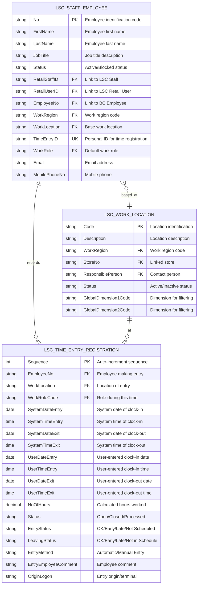
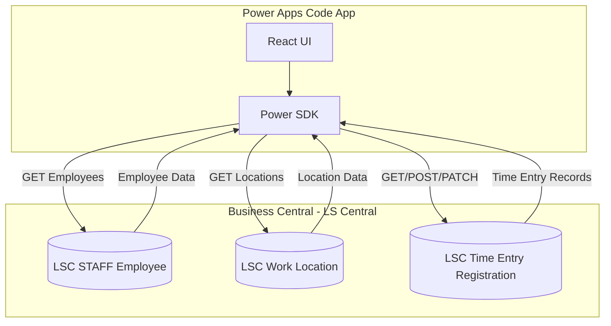
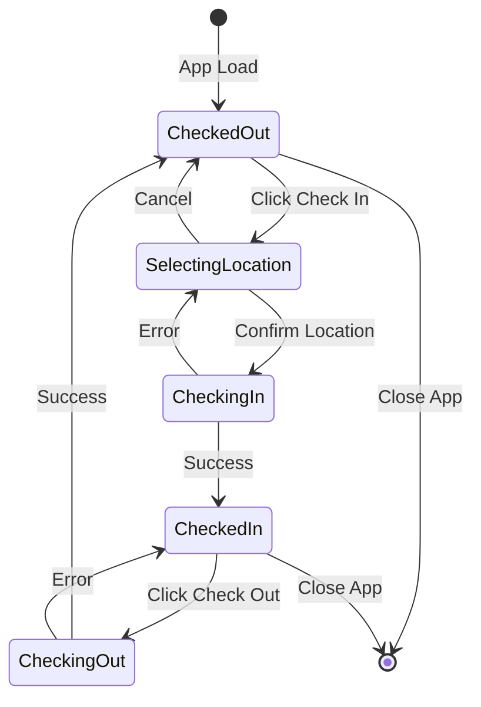
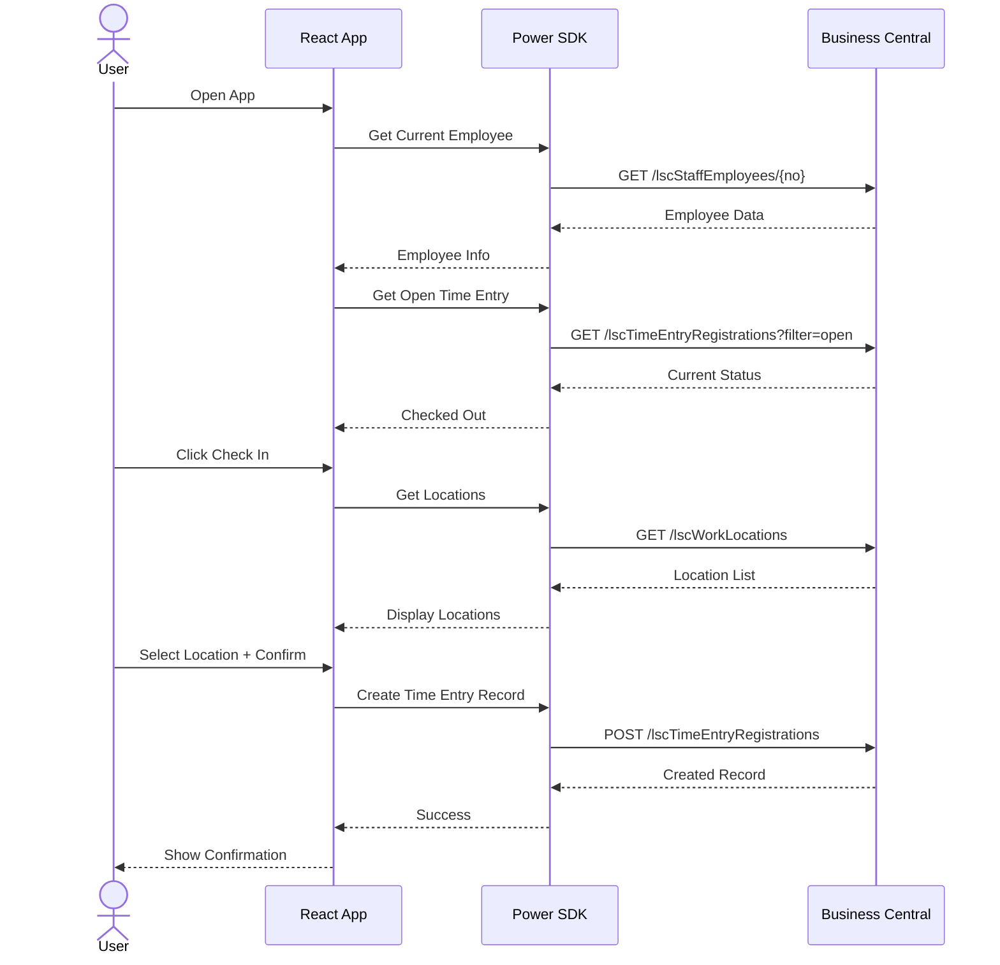

# Check In / Check Out App - Database Schema

## Overview
This document describes the database schema for the Time Registration App, utilizing LS Central Staff Management tables in Business Central.

---

## Entity Relationship Diagram

## Data Flow Diagram

## State Diagram - Check-In/Check-Out Flow

## Sequence Diagram - Check-In Process

---

## Business Central Table Specifications

### Table 10015057 - LSC STAFF Employee
**Purpose:** Central table for staff management employee records

Uses the LS Central Staff Employee entity with the following key fields:

| Field No. | BC Field | App Field | Type | Description |
|-----------|----------|-----------|------|-------------|
| 1 | No. | Id | Code[20] | Primary Key - Employee identification |
| 2 | First Name | FirstName | Text[30] | Employee first name |
| 3 | Last Name | LastName | Text[30] | Employee last name |
| 5 | Job Title | JobTitle | Text[30] | Job title description |
| 8 | Status | Status | Option | Active/Blocked status |
| 20 | Retail Staff ID | RetailStaffID | Code[20] | Link to LSC Staff record |
| 21 | Retail User ID | RetailUserID | Code[50] | Link to LSC Retail User |
| 22 | Employee No. | EmployeeNo | Code[20] | Link to BC Employee |
| 30 | Work Region | WorkRegion | Code[20] | Work region for sharing |
| 31 | Work Location | WorkLocation | Code[20] | Base work location |
| 35 | Time Entry ID | TimeEntryID | Code[20] | Personal ID for time registration |
| 60 | Work Role | WorkRole | Code[10] | Default work role |
| 100 | E-Mail | Email | Text[80] | Email address |
| 101 | Mobile Phone No. | MobilePhoneNo | Text[30] | Mobile phone |

#### Business Rules
- No. is auto-assigned from number series on insert
- Status changes trigger contract date updates
- Work Location change updates Work Region automatically
- Time Entry ID must be unique

---

### Table 10015021 - LSC Work Location
**Purpose:** Master table for work locations/sites in staff management

| Field No. | BC Field | App Field | Type | Description |
|-----------|----------|-----------|------|-------------|
| 1 | Code | Id | Code[20] | Primary Key - Location identification |
| 2 | Description | Name | Text[100] | Location description |
| 10 | Work Region | WorkRegion | Code[20] | Work region for sharing |
| 20 | Store No. | StoreNo | Code[10] | Linked store for sales |
| 30 | Responsible Person | ResponsiblePerson | Code[20] | Contact person (LSC STAFF Employee) |
| 40 | Status | Status | Option | Active/Inactive status |
| 50 | Global Dimension 1 Code | GlobalDimension1Code | Code[20] | Dimension for filtering |
| 51 | Global Dimension 2 Code | GlobalDimension2Code | Code[20] | Dimension for filtering |

#### Business Rules
- Code is required and must be unique
- Store Name is calculated from Store No.
- Responsible contact info calculated from Responsible Person

---

### Table 10015007 - LSC Time Entry Registration
**Purpose:** Transaction table for employee time clock entries

| Field No. | BC Field | App Field | Type | Description |
|-----------|----------|-----------|------|-------------|
| 1 | Sequence | Id | Integer | Auto-increment PK |
| 10 | Employee No. | EmployeeNo | Code[20] | FK to LSC STAFF Employee |
| 11 | Work Location | WorkLocation | Code[20] | FK to LSC Work Location |
| 12 | Work Role Code | WorkRoleCode | Code[10] | Role during this time |
| 20 | System Date (Entry) | SystemDateEntry | Date | System date of clock-in |
| 21 | System Time (Entry) | SystemTimeEntry | Time | System time of clock-in |
| 22 | System Date (Exit) | SystemDateExit | Date | System date of clock-out |
| 23 | System Time (Exit) | SystemTimeExit | Time | System time of clock-out |
| 30 | User Date (Entry) | UserDateEntry | Date | User-entered clock-in date |
| 31 | User Time (Entry) | UserTimeEntry | Time | User-entered clock-in time |
| 32 | User Date (Exit) | UserDateExit | Date | User-entered clock-out date |
| 33 | User Time (Exit) | UserTimeExit | Time | User-entered clock-out time |
| 50 | No. Of Hours | NoOfHours | Decimal | Calculated hours worked |
| 60 | Status | Status | Option | Open/Closed/Processed |
| 61 | Entry Status | EntryStatus | Option | OK/Early/Late/Not Scheduled |
| 62 | Leaving Status | LeavingStatus | Option | OK/Early/Late/Not in Schedule |
| 70 | Entry Method | EntryMethod | Option | Automatic/Manual Entry |
| 80 | Entry Employee Comment | EntryEmployeeComment | Text[100] | Employee's comment |
| 90 | Origin (Logon) | OriginLogon | Code[50] | Entry origin/terminal |

#### Business Rules
- Sequence is auto-incremented on insert
- Supports automatic (time clock) and manual entry methods
- Tracks both system time and user-adjusted time
- Status indicates processing state (Open → Closed → Processed)
- Entry/Leaving status validates against schedule
- Hours calculated from entry/exit times

---

## Time Entry Process Flow

### Check-In (Clock-In)
1. Employee selects location and clicks Check In
2. Record created in LSC Time Entry Registration
3. Employee No., Work Location, Work Role recorded
4. System Date/Time (Entry) captured
5. Status = Open

### Check-Out (Clock-Out)
1. Employee clicks Check Out
2. System Date/Time (Exit) recorded
3. No. Of Hours calculated
4. Entry/Leaving Status validated against schedule
5. Status changed to Closed

### Supervisor Review
1. Review entries for accuracy
2. Add supervisor comments if needed
3. Adjust times if necessary (User Date/Time fields)

### Processing
1. Time entries converted to Salary Entries
2. Status changed to Processed
3. Data exported for payroll

---

## Key Integration Points

### With Business Central Standard Tables
- **Employee** - Links staff management to BC employee master data via Employee No.
- **Dimension Value** - Financial dimension integration for reporting

### With LS Central Retail
- **LSC Staff** - POS staff records via Retail Staff ID
- **LSC Retail User** - User authentication and portal access via Retail User ID
- **LSC Store** - Store master data via Store No.

### Within Staff Management Module
- **LSC Work Region** - Geographical/organizational grouping
- **LSC Work Roles** - Job function definitions
- **LSC Work Shifts** - Shift patterns and schedules

---

## Performance Considerations

### Indexing Strategy
- **LSC STAFF Employee**: Indexed on No., Retail Staff ID, Retail User ID, Employee No., Time Entry ID, Work Location
- **LSC Work Location**: Indexed on Code, Store No., Work Region
- **LSC Time Entry Registration**: Auto-increment Sequence provides natural clustering

### Data Volume Estimates
- **LSC STAFF Employee**: Low-Medium volume (100s to 1000s of records)
- **LSC Work Location**: Low volume (10s to 100s of records)
- **LSC Time Entry Registration**: High volume (1000s to millions of records) - transactional data

---

## Version History

| Version | Date | Author | Changes |
|---------|------|--------|---------|
| 1.0 | 2026-01-02 | - | Initial database schema |
| 2.0 | 2026-01-03 | - | Updated to use LS Central Staff Management tables |
